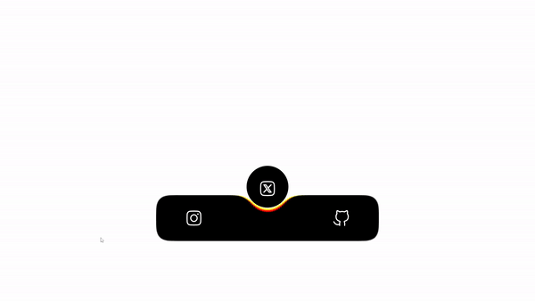

# Animated Tab Bar

This project features an animated tab bar developed by Aarzoo as part of the 100 Days of Code challenge. It creates a visually appealing tab interface with dynamic animations using HTML and CSS.

## Preview

    

This preview showcases the animated tab bar in action.

## How to Use

1. Clone or download the repository.
2. Open the `index.html` file in a web browser.

## File Structure

- `index.html`: Contains the HTML structure for the animated tab bar.
- `style.css`: Includes the CSS styles for the tab bar animations and appearance.
- `image/`: Directory containing SVG images used as icons for the tab labels.

## HTML Structure

- The `index.html` file consists of a basic HTML structure with a viewport meta tag and a link to the external CSS file (`style.css`).
- Inside the `<body>` tag, there's a container `
` with the class `phone`, representing the phone frame.
- Within the phone container, there are radio input elements (`<input>`) for tab selection, labeled with icons using `<label>` tags.
- The selected tab is indicated by a circle element with the class `circle`.
- The content of each tab is contained within the `.phone_content` `
`, and the bottom section of the phone contains the tab indicator with the class `indicator`.

## CSS Styles

- The `style.css` file contains styles to reset default margin, padding, and box-sizing for consistency across browsers.
- Various CSS rules are applied to achieve the desired appearance and animation effects for the tab bar.
- Styles for the phone container, tab labels, icons, indicator, and circle are defined to create a cohesive visual experience.
- CSS rules with pseudo-classes (`:checked`) are used to apply different styles based on the selected tab.

## Author Information

This project was developed by [Aarzoo](https://twitter.com/withaarzoo) as part of the 100 Days of Code challenge.

---

Feel free to explore and modify the code according to your needs. If you have any questions or feedback, please reach out to the author on Twitter.
