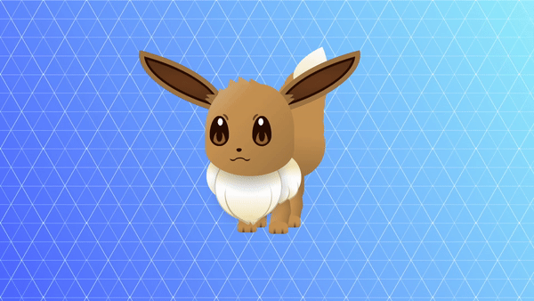

# Animated Eevee Pkemon

## Description

This project showcases an animated eevee pokemon created using HTML and CSS. The animation includes various elements such as blinking eyes, wagging tail, and moving ears to bring the eevee to life.

## Preview

<div style="display: flex; align-items: center; justify-content: center; width: 100%; border-radius: 0.6rem;">
    
</div>

This preview showcases the animated eevee in action.

## Features

- Eye blinking animation
- Tail wagging animation
- Ear shaking animation
- Mouth movement animation
- Body shaking animation
- Neck shaking animation

## Intended Use

This project can be used as a fun addition to websites or applications that involve animations. It's a great way to add personality and charm to your digital creations.

## Installation

1. Clone the repository:

   ```
   git clone https://github.com/withaarzoo/Animated-Eevee-Pokemon.git
   ```

2. Open the `index.html` file in your web browser.

## Usage

- Simply open the HTML file in a web browser to view the animated cute puppy.
- Customize the animations or add more features according to your preferences by modifying the CSS file.

## License

This project is licensed under the [License Name] License - see the [LICENSE](LICENSE) file for details.

---

Feel free to customize the README according to your project's specific details and requirements. You can also include links to your social media profiles or personal website for contact or further information.
