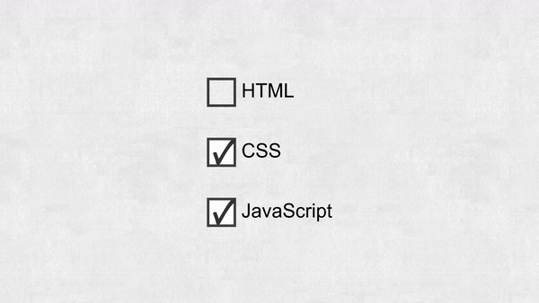

# Pencil and Paper Checkbox

This project is part of Day 14 of the #100DaysOfCode Challenge, aimed at improving coding skills by committing to code daily for 100 days.

This project consists of HTML, CSS, and JavaScript code to create a unique pencil and paper checkbox effect. The checkbox design mimics the appearance of a checkbox being filled in with a pencil, followed by the appearance of lines drawn on paper .

## Preview

<div style="display: flex; align-items: center; justify-content: center; width: 100%; border-radius: 0.6rem;">
    
</div>

This preview showcases the animated pencil and paper checkboxr in action.

## Download Full Source Code

You can download the full source code for this project from the following link: [Download Source Code](https://t.me/CodeWithAarzoo)

## Usage

To use this project, simply include the provided HTML, CSS, and JavaScript files in your project directory and link them appropriately in your HTML file.

```html
<!DOCTYPE html>
<html lang="en">
<head>
    <!-- Set character encoding for the document -->
    <meta charset="UTF-8">
    <!-- Set compatibility mode for Internet Explorer -->
    <meta http-equiv="X-UA-Compatible" content="IE=edge">
    <!-- Set viewport properties for responsive design -->
    <meta name="viewport" content="width=device-width, initial-scale=1.0">
    <!-- Link to external stylesheet -->
    <link rel="stylesheet" href="style.css">
    <!-- Set the title of the document -->
    <title>Pencil and Paper Checkbox</title>
</head>
<body>
    <!-- Create a container div with class "center" -->
    <div class="center">
        <!-- Create a form -->
        <form>
            <!-- Create checkbox inputs for different subjects -->
            <label><input class="cb pristine" type="checkbox"> <span>HTML</span></label>
            <label><input class="cb pristine" type="checkbox"> <span>CSS</span></label>
            <label><input class="cb pristine" type="checkbox"> <span>JavaScript</span></label>
        </form>
    </div>

    <!-- Link to external JavaScript file -->
    <script src="script.js"></script>
</body>
</html>

```

## Features

- Custom checkbox design with pencil and paper animation effects.
- Responsive design suitable for various screen sizes.
- Easy to integrate into existing projects.
- Lightweight and efficient code.

## CSS Styles

The CSS file (`style.css`) contains styles for the checkbox design, including animations for drawing and erasing effects.

## JavaScript Functionality

The JavaScript file (`script.js`) adds functionality to remove the pristine state class from checkboxes when they are clicked. This triggers the animation effect to simulate filling in the checkbox with a pencil.

## Dependencies

This project does not rely on any external libraries or frameworks, making it easy to incorporate into any web project.

## Credits

The design and implementation of this pencil and paper checkbox effect were inspired by various CSS animations and checkbox styling techniques found online. Special thanks to the contributors who shared their knowledge and ideas.

## Support and Contact

For any inquiries or assistance regarding this project, feel free to reach out to the developer, Aarzoo, via [Bento](https://bento.me/withaarzoo).

## License

This project is licensed under the [MIT License](LICENSE). Feel free to use, modify, and distribute it as needed.
