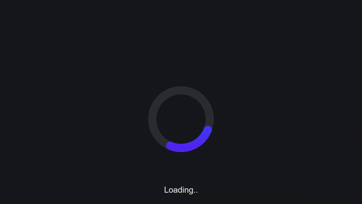

# Animated Preloader

This project is part of Day 15 of the #100DaysOfCode Challenge, aimed at improving coding skills by committing to code daily for 100 days.

This is a simple HTML and CSS code snippet that creates an animated preloader. The preloader is designed to provide a visual indication to users that content is being loaded.

## Preview

<div style="display: flex; align-items: center; justify-content: center; width: 100%; border-radius: 0.6rem;">
    
</div>

This preview showcases the animated preloader in action.

## Download Full Source Code

You can download the full source code for this project from the following link: [Download Source Code](https://t.me/CodeWithAarzoo)

## Usage

To use this code snippet, follow the instructions below:

1. Create an HTML file and copy the HTML code provided into the file.
2. Create a CSS file and copy the CSS code provided into the file.
3. Save both files in the same directory.
4. Link the CSS file to the HTML file by adding the following line of code within the <head> section of your HTML file:

```html
<link rel="stylesheet" href="style.css">
```

5. Open the HTML file in a web browser to see the animated preloader.

## HTML Structure

The HTML code consists of a basic structure with the following elements:

* `<!DOCTYPE html>`: Defines the document type as HTML5.
* `<html>`: Represents the root element of an HTML document.
* `<head>`: Contains meta information and external resources used by the document.
* `<body>`: Represents the main content of the HTML document.
* `<main>`: Contains the animated preloader SVG.
* `<svg>`: Defines an SVG element to display the preloader animation.
  
## CSS Styling

The CSS code provided in the `style.css` file is responsible for styling the preloader and creating the animation effect. It includes the following key aspects:

* CSS Reset: Resets the default styling of HTML elements.
* CSS Variables: Defines custom CSS variables for color and font size.
* Background and Text Styling: Sets the background color, text color, and font properties.
* Layout and Alignment: Centers the preloader vertically and horizontally.
* Dark Theme Support: Adjusts the colors for a dark color scheme using the `prefers-color-scheme` media query.
* Animation Keyframes: Defines the keyframes for the two animation sequences (`worm1` and `worm2`) used in the preloader.
  
## Customization

You can customize the appearance of the preloader by modifying the CSS variables defined in the `:root` selector of the CSS file. By changing the values of these variables, you can adjust the colors and font size according to your preference.

## Compatibility

This code snippet is compatible with modern web browsers that support HTML5 and CSS3 features. It is recommended to test the preloader in different browsers to ensure proper functionality.

Note: This code snippet is provided as a demonstration and may require further modifications to fit into a specific project or integrate with existing code.

Feel free to use this code snippet as a starting point for creating your own animated preloaders or enhancing the user experience of your web applications.

## Support and Contact

For any inquiries or assistance regarding this project, feel free to reach out to the developer, Aarzoo, via [Bento](https://bento.me/withaarzoo).
