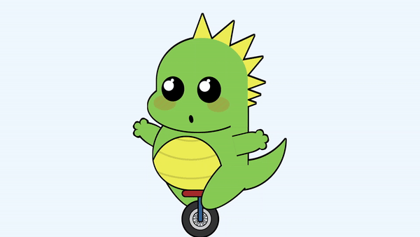

# Animated Dinosaur on a Unicycle

This project is a fun and whimsical animation of a dinosaur riding a unicycle, created as part of Day 16 of the #100DaysOfCode Challenge. The animated dinosaur is built using HTML and CSS, with intricate styling and keyframe animations to bring it to life.

## Preview

    

This preview showcases the animated dinosaur on a unicycle in action.

## Download Full Source Code

You can download the full source code for this project from the following link: [Download Source Code](https://t.me/CodeWithAarzoo)

## Overview

The animated dinosaur consists of various HTML elements styled and positioned using CSS to create the desired visual effect. Keyframe animations are used to animate different parts of the dinosaur, such as its movement, facial expressions, and even the rotation of the unicycle wheel.

## Features

- **Animated Movement:** The dinosaur's body parts, including its arms, legs, and tail, are animated to simulate movement as it rides the unicycle.
- **Facial Expressions:** The dinosaur's face features animated elements such as eyes, cheeks, and a mouth, giving it expressive facial animations.
- **Dynamic Wheel Rotation:** The wheel of the unicycle rotates dynamically using CSS animations, adding to the overall lively feel of the animation.
- **Whimsical Design:** The design of the dinosaur and the unicycle is playful and whimsical, making it an engaging and entertaining animation.

## How to Use

To use this animated dinosaur on a unicycle:

1. **Download the Source Code:** You can download the full source code from [here](https://t.me/CodeWithAarzoo).
2. **Include the HTML and CSS:** Add the HTML code to your webpage's body section and link the CSS file to apply the styles.
3. **Customize (Optional):** Feel free to customize the code to fit your specific requirements or to add your own creative touches.
4. **Run Your Code:** After integrating the code into your project, run your webpage to see the animated dinosaur in action.

## Support and Contact

For any inquiries or assistance regarding this project, feel free to reach out to the developer, Aarzoo, via [Bento](https://bento.me/withaarzoo).

Enjoy coding and have fun with your animated dinosaur on a unicycle! 🦖🚲✨
