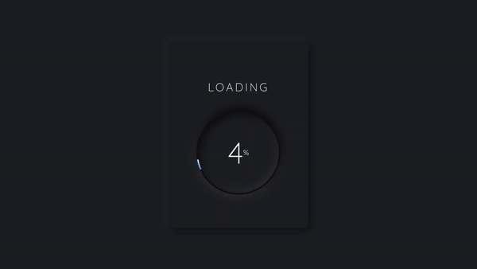

# Neumorphism Loader

This project is part of Day 18 of the #100DaysOfCode Challenge, aimed at improving coding skills by committing to code daily for 100 days.

This is a simple HTML, CSS, and JavaScript implementation of a neumorphism-style loader. Neumorphism is a design trend that aims to create a soft, 3D-like appearance, often with elements that appear to be pressed into or extruded from a background surface.

## Preview

<div style="display: flex; align-items: center; justify-content: center; width: 100%; border-radius: 0.6rem;">
    
</div>

This preview showcases the animated neumorphism loader in action.

## Download Full Source Code

You can download the full source code for this project from the following link: [Download Source Code](https://t.me/CodeWithAarzoo)

## Features

- Neumorphism-style loader design.
- Displays a loading percentage.

## Usage

You can use this code by following these simple steps:

1. Clone or download this repository to your local machine.

2. Open the `index.html` file in your web browser. You should see the Neumorphism Loader in action.

## Code Structure

- **HTML**: The structure of the loader is defined in `index.html`. It contains a loading box with a loading title and a loading circle to display the percentage.

- **CSS**: The styling for the loader is defined in `style.css`. It applies neumorphism-style design to the loader elements, including shadows, gradients, and animations.

- **JavaScript**: The loader functionality is implemented in `script.js`. It updates the loader percentage and animates the loading circle using JavaScript.

## Dependencies

This project uses the Google Fonts API to import the "Quicksand" font for the loader's text. It's imported in the CSS file as follows:

```css
@import url("https://fonts.googleapis.com/css2?family=Quicksand:wght@300&display=swap");
```

## Contributing

Feel free to contribute to this project by opening issues or creating pull requests. Your contributions are welcome!

## License

This project is licensed under the MIT License. See the [LICENSE](LICENSE) file for details.

## Support and Contact

For any inquiries or assistance regarding this project, feel free to reach out to the developer, Aarzoo, via [Bento](https://bento.me/withaarzoo).

Enjoy coding and have fun with your animated dinosaur on a unicycle! 🦖🚲✨

---

Enjoy using the Neumorphism Loader! If you have any questions or suggestions, please feel free to reach out.
