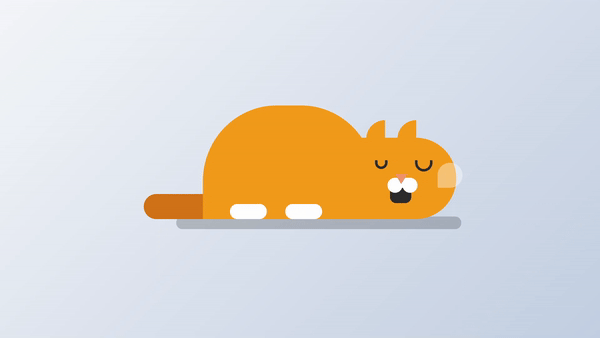

# Animated Sleeping Cat

This project is part of Day 19 of the #100DaysOfCode Challenge.

This project showcases an animated sleeping cat created using HTML and CSS. It's a fun and creative way to explore front-end development and animation techniques.

## Preview

    

This preview showcases the animated sleeping cat in action.

## Download Full Source Code

You can download the full source code for this project from the following link: [Download Source Code](https://t.me/CodeWithAarzoo)

## Features

- **HTML Structure**: The HTML file provides the structure for the sleeping cat, including its ears, eyes, nose, mouth, body, tail, and speech bubble.
- **CSS Styling**: The CSS file contains styles for each element of the cat, including positioning, colors, and animations for a realistic sleeping effect.
- **Animations**: Various animations are applied to elements such as the mouth, body, speech bubble, and shadow to create a lively and engaging scene.

## Usage

To use this project:

1. Clone or download the source code from [here](https://t.me/CodeWithAarzoo).
2. Open the HTML file in a web browser to view the animated sleeping cat.
3. Feel free to customize the code to create your own variations or incorporate it into your projects.

## Contributing

Feel free to contribute to this project by opening issues or creating pull requests. Your contributions are welcome!

## License

This project is licensed under the MIT License. See the [LICENSE](LICENSE) file for details.

## Support and Contact

For any inquiries or assistance regarding this project, feel free to reach out to the developer, Aarzoo, via [Bento](https://bento.me/withaarzoo).

Enjoy coding and have fun with your animated sleeping cat 😺💤✨

---

Enjoy using the Neumorphism Loader! If you have any questions or suggestions, please feel free to reach out.
