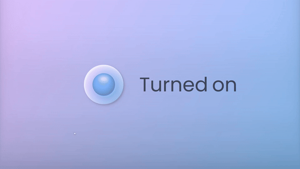

# Animated Toogle Switch

Welcome to my #100DaysOfCode challenge project! In this project, I've implemented a custom checkbox toggle with associated text, utilizing HTML and CSS.

## Preview

    

This preview showcases the animated tab bar in action.

## Overview

This project focuses on creating a visually appealing checkbox toggle with accompanying text options. The toggle design incorporates custom styling, including animations and transitions, to enhance user interaction.

## Features

- Custom checkbox toggle design
- Smooth transitions and animations
- Responsive layout

## Project Structure

The project consists of HTML and CSS files:

- `index.html`: Contains the HTML structure for the checkbox toggle and associated text.
- `styles.css`: Defines the custom styles for the checkbox toggle, including colors, shadows, and animations.

## Usage

To use the custom checkbox toggle in your project:

1. Clone or download the project repository.
2. Copy the HTML code from `index.html` and integrate it into your HTML file.
3. Copy the CSS code from `styles.css` and integrate it into your CSS file or style section.

## Support and Connect

For more updates on my #100DaysOfCode challenge and other coding projects, you can:

- [Join my Telegram channel](https://t.me/CodeWithAarzoo) for the latest source code updates.
- [Connect with me on Twitter](https://t.co/3ZmX6pBLnv) for discussions and collaborations.

Let's connect and code together!

## License

This project is licensed under the [MIT License](LICENSE).

---

Thank you for checking out my #100DaysOfCode project! If you have any questions or suggestions, feel free to reach out. Happy coding!
