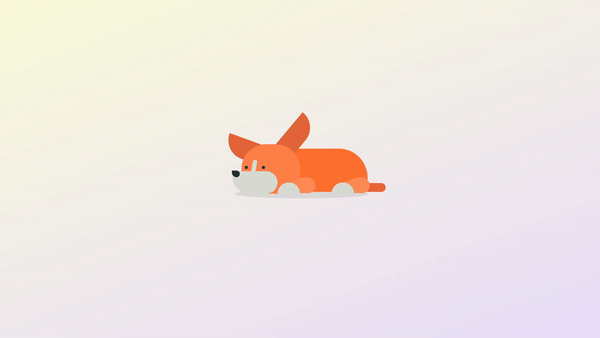

# Animated Puppy

This project is part of Day 20 of the #100DaysOfCode Challenge.

This project is a delightful animation of a puppy created using HTML and CSS. The animated puppy consists of various elements such as its body, head, ears, eyes, nose, tail, and legs, all of which come together to create a cute and lively visual .

## Preview

    

This preview showcases the animated puppy in action.

## Download Full Source Code

You can download the full source code for this project from the following link: [Download Source Code](https://t.me/CodeWithAarzoo)

## How to Use

To use this animation, simply copy the HTML and CSS code provided into your project files. The HTML code defines the structure of the animated puppy, while the CSS code provides the styling and animation effects.

## HTML Structure

The HTML structure consists of a main container div containing the animated puppy elements like body, head, ears, eyes, nose, tail, and legs. Each part of the puppy is represented using nested div elements with specific class names for styling and animation.

## CSS Styling

The CSS file contains styling rules for the animated puppy. It includes positioning, dimensions, colors, border radii, and animation keyframes to create the desired visual effect. The animation keyframes control the movement and transformation of different parts of the puppy to achieve a lively and playful animation.

## Keyframe Animations

Various keyframe animations are used to create the movement and interaction within the animated puppy. These animations control the height, rotation, and transformation of different elements such as the head, ears, snout, eyes, and tail, giving the impression of a playful puppy.

## Contributing

Feel free to contribute to this project by opening issues or creating pull requests. Your contributions are welcome!

## License

This project is licensed under the MIT License. See the [LICENSE](LICENSE) file for details.

## Support and Contact

For any inquiries or assistance regarding this project, feel free to reach out to the developer, Aarzoo, via [Bento](https://bento.me/withaarzoo).

Enjoy coding and have fun with your animated puppy 🐶✨

---

Enjoy using the Animated Puppy! If you have any questions or suggestions, please feel free to reach out.
