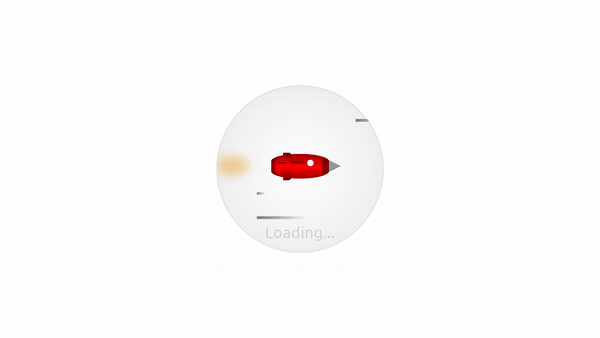

# Animated Rocket Loader

This project is part of Day 23 of the #100DaysOfCode Challenge.

This is a simple HTML and CSS code snippet that creates an animated rocket loader. It's a fun and visually appealing way to indicate that something is loading or processing in your web application. The rocket moves upward and emits smoke as it goes, giving the impression of a rocket taking off.

## Preview

<div style="display: flex; align-items: center; justify-content: center; width: 100%; border-radius: 0.6rem;">
    
</div>

This preview showcases the animated rocket loader in action.

## Download Full Source Code

You can download the full source code for this project from the following link: [Download Source Code](https://t.me/CodeWithAarzoo)

## How to Use

To use this animated rocket loader in your web project, follow these steps:

1. Copy the HTML code into your HTML file, typically within the `<body>` tags.

```html
<!DOCTYPE html>
<html lang="en">

<head>
    <!-- Add the CSS link to your HTML head -->
    <link rel="stylesheet" href="style.css">
    <title>Animated Rocket Loader</title>
</head>

<body>
    <!-- Add the rocket loader div -->
    <div class="rocket-loader">
        <div class="rocket">
            <div class="rocket-extras"></div>
            <div class="jet"><span></span></div>
        </div>
    </div>
</body>

</html>
```

2. Copy the CSS code into your `style.css` file or include it in your existing CSS file.

```css
@import url("https://fonts.googleapis.com/css?family=Ubuntu:400,400i,700,700i");

/* ... (Paste the CSS code here) ... */
```

3. Save your HTML and CSS files.

4. Open your HTML file in a web browser to see the animated rocket loader in action.

## Customization

Feel free to customize the loader to match your project's style and preferences. You can adjust the following aspects:

- **Colors**: Modify the background colors and gradients in the CSS to change the appearance of the loader.

- **Rocket Size**: Adjust the width and height properties in the `.rocket-loader` and `.rocket` classes to change the size of the rocket.

- **Text**: You can change the "Loading..." text or remove it altogether by modifying the `.rocket-loader::before` CSS rule.

- **Animation Speed**: You can alter the animation durations in the CSS to make the rocket move faster or slower.

## Credits

This code snippet has been crafted by [Aarzoo](https://twitter.com/withaarzoo).

## Support and Contact

For any inquiries or assistance regarding this project, feel free to reach out to the developer, Aarzoo, via [Bento](https://bento.me/withaarzoo).

Enjoy coding and have fun with your animated rocket loader 🚀✨

---

Enjoy using the animated rocket loader! If you have any questions or suggestions, please feel free to reach out.
