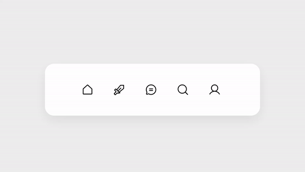

# Menu With Hover Reveal

This project is part of Day 24 of the #100DaysOfCode Challenge.

This is a simple menu with hover reveal effects using HTML and CSS. When you hover over the menu items, they expand to reveal additional information. Each menu item consists of an icon and a title.

## Preview

<div style="display: flex; align-items: center; justify-content: center; width: 100%; border-radius: 0.6rem;">
    
</div>

This preview showcases the animated rocket loader in action.

## Download Full Source Code

You can download the full source code for this project from the following link: [Download Source Code](https://t.me/CodeWithAarzoo)

## How to Use

To use this menu in your project, follow these steps:

1. Download the HTML and CSS files from the [dgicode.store](https://dgicode.store/product/menu-with-hover-reveal-using-html-and-css/) website .

2. Include the HTML and CSS files in your project's directory.

3. Open the HTML file in your web browser to see the menu in action.

## HTML Structure

```html
<!DOCTYPE html>
<html lang="en">
<head>
    <!-- Meta tags and title -->
</head>
<body>
    <div class="custom-menu">
        <!-- Menu items go here -->
    </div>
</body>
</html>
```

Replace the `<!-- Menu items go here -->` comment with the menu items you want to display.

## CSS

The CSS file (`style.css`) contains styles for the menu, links, and hover effects. You can customize the colors, fonts, and other styles to match your project's design.

## Dependencies

This project uses the "Inter" font from Google Fonts. Make sure to include the following line in the `<head>` section of your HTML file to load the font:

```html
<link rel="stylesheet" href="https://fonts.googleapis.com/css2?family=Inter:wght@300;400;500;600;700;800;900&display=swap">
```

## License

This project is available under the [MIT License](LICENSE).

## Credits

This code snippet has been crafted by [Aarzoo](https://twitter.com/withaarzoo).

## Support and Contact

For any inquiries or assistance regarding this project, feel free to reach out to the developer, Aarzoo, via [Bento](https://bento.me/withaarzoo).

Enjoy coding and have fun with your animated rocket loader 🚀✨

---

Enjoy using the animated rocket loader! If you have any questions or suggestions, please feel free to reach out.
