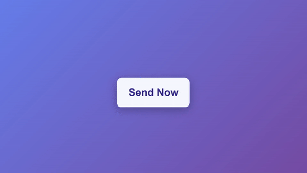

# Animated Paper Plane Button

This project is part of Day 25 of the #100DaysOfCode Challenge.

Create an engaging and interactive animated paper plane button with this HTML, CSS, and JavaScript code. When clicked, this button transforms into a paper plane and sends with a success message, adding a delightful touch to your web application.

## Preview

<div style="display: flex; align-items: center; justify-content: center; width: 100%; border-radius: 0.6rem;">
    
</div>

This preview showcases the animated send button with paper plane animation in action.

## Download Full Source Code

You can download the full source code for this project from the following link: [Download Source Code](https://t.me/CodeWithAarzoo)

## Table of Contents

- [Features](#features)
- [Installation](#installation)
- [Usage](#usage)
- [Customization](#customization)
- [License](#license)
- [Credits](#credits)
- [Support and Contact](#support-and-contact)

## Features

- Engaging and interactive paper plane animation on button click.
- Success message upon successful completion of the animation.
- Customizable button styles and animation parameters.

## Installation

To use this animated paper plane button in your project, follow these steps:

1. **Clone the Repository**:

   Clone this repository to your local machine using Git:

   ```shell
   git clone https://github.com/your-username/animated-paper-plane-button.git
   ```

2. **Include the Files**:

   - Copy the `style.css` file to your project's CSS directory.
   - Copy the `script.js` file to your project's JavaScript directory.
   - Include the GreenSock Animation Platform (GSAP) library by adding the following script tag to your HTML file:

     ```html
     <script src="https://cdnjs.cloudflare.com/ajax/libs/gsap/3.12.2/gsap.min.js" integrity="sha512-16esztaSRplJROstbIIdwX3N97V1+pZvV33ABoG1H2OyTttBxEGkTsoIVsiP1iaTtM8b3+hu2kB6pQ4Clr5yug==" crossorigin="anonymous" referrerpolicy="no-referrer"></script>
     ```

## Usage

1. **HTML Structure**:

   In your HTML file, create a button element with the class "button" and an anchor element for the Twitter link with the class "twitter":

   ```html
   <!DOCTYPE html>
   <html lang="en">
   <head>
       <!-- Add meta tags and title here -->
       <link rel="stylesheet" href="style.css" />
   </head>
   <body>
       <button class="button">
           <!-- Button content goes here -->
       </button>
       <!-- Twitter link -->
       <a class="twitter" target="_blank" href="https://twitter.com/your-twitter-handle">
           <!-- Twitter icon goes here -->
       </a>
       <script src="script.js"></script>
   </body>
   </html>
   ```

2. **Customization**:

   You can customize the button's appearance and animation parameters by modifying the CSS variables in the `style.css` file. Adjust colors, shapes, and animations to match your design preferences.

3. **Demo Integration**:

   To integrate this animated paper plane button into your project, copy the button's HTML structure from the provided code and add it to your desired web page.

4. **Include JavaScript**:

   Make sure to include the GreenSock Animation Platform (GSAP) library as shown in the installation steps. The `script.js` file contains the JavaScript code responsible for the button's animation.

## Customization

Customize the button's appearance and animation by modifying the CSS variables in the `style.css` file. Here are some key variables you can adjust:

- `--primary`: Button's primary background color.
- `--text`: Button's text color.
- `--trails`: Color of the animated trails.
- `--success`: Color of the success message.
- Various animation parameters like duration and timing can be adjusted in the JavaScript code to change the animation's speed and behavior.

## License

This code is provided under the [MIT License](LICENSE). Feel free to use, modify, and distribute it in your projects. If you find it useful, a star to the repository would be appreciated!

## Credits

This code snippet has been crafted by [Aarzoo](https://twitter.com/withaarzoo).

## Support and Contact

For any inquiries or assistance regarding this project, feel free to reach out to the developer, Aarzoo, via [Bento](https://bento.me/withaarzoo).

Enjoy coding and have fun with your animated send button with paper plane animation🚀✨

---

Enjoy using the animated send button with paper plane animation! If you have any questions or suggestions, please feel free to reach out.
