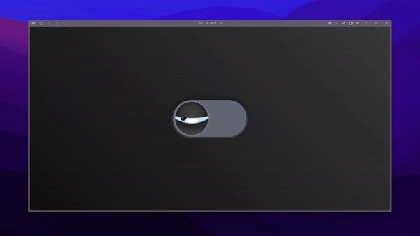

# Animated Eye Toggle

This project is part of Day 26 of the #100DaysOfCode Challenge.

This project showcases an animated eye toggle created using HTML and CSS. The toggle switch features an eye that opens and closes as the switch is toggled on and off.

## Preview

    

This preview showcases the animated eye toggle switch in action.

## Download Full Source Code

You can download the full source code for this project from the following link: [Download Source Code](https://t.me/CodeWithAarzoo)

## Features

- Interactive eye toggle switch
- Smooth animations and transitions
- Stylish design with gradient backgrounds and shadow effects

## Installation

1. Clone the repository: `git clone https://github.com/withaarzoo/100-Days-of-Code/tree/main/%5B%20Day%2026%20%5D%20-%20Animated%20Eye%20Toggle%20Switch.git`
2. Open `index.html` in your web browser

## Usage

Simply click on the eye toggle switch to see the eye open and close. The animation is triggered by toggling the switch on and off.

## Customization

- Modify the CSS variables in the `style.css` file to change the size and colors of the eye toggle.
- Experiment with different animations and effects by adjusting the keyframes in the CSS file.

## License

This project is licensed under the MIT License - see the [LICENSE](LICENSE) file for details.

## Credits

This code snippet has been crafted by [Aarzoo](https://twitter.com/withaarzoo).

## Support and Contact

For any inquiries or assistance regarding this project, feel free to reach out to the developer, Aarzoo, via [Bento](https://bento.me/withaarzoo).

Enjoy coding and have fun with your animated eye toggle switch 👁️✨

---

Enjoy using the animated eye toggle switch! If you have any questions or suggestions, please feel free to reach out.
