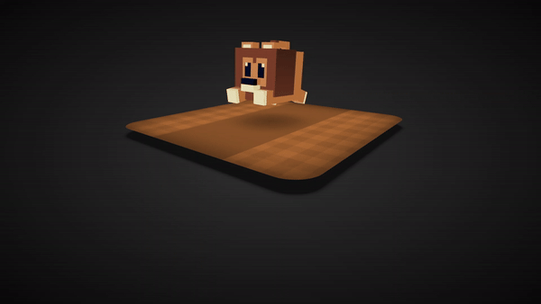

# Animated Cute Lion

Welcome to the **Animated Cute Lion** repository! This project showcases a delightful animated lion created using HTML and CSS animations. It's a fun and engaging way to learn about web animations while enjoying the cuteness of a lion.

## Preview

<div style="display: flex; align-items: center; justify-content: center; width: 100%; border-radius: 0.6rem;">
    
</div>

This preview showcases the animated cute lion in action.

## Download Full Source Code

You can download the full source code for this project from the following link: [Download Source Code](https://t.me/CodeWithAarzoo)

## Features

- 🦁 **Adorable Animation**: Watch an adorable lion come to life through CSS animations.
- 🌈 **Vibrant Colors**: The lion's vibrant colors make it visually appealing.
- 🖥️ **Browser Compatibility**: The animation is designed to work across various modern web browsers.
- 📦 **Easy to Use**: Clone the repository and open the HTML file in your browser to see the animation.

## How to Use

1. **Clone the Repository**:

   Clone this repository to your local machine using the following command:

   ```bash
   git clone https://github.com/Aarzoo75/Animated-Cute-Lion-.git
   ```

2. **Open the HTML File**:

   Navigate to the repository folder and open the `index.html` file in your preferred web browser. You'll immediately see the adorable animated lion in action.

3. **Enjoy and Learn**:

   Feel free to explore the HTML and CSS files to understand how the animation is created. This project is a great opportunity to learn about CSS animations and how they can be used to bring elements to life on a webpage.

## Contribution

Contributions are welcome! If you'd like to enhance the animation, fix any issues, or add new features, follow these steps:

1. Fork the repository to your own GitHub account.
2. Create a new branch with a descriptive name related to your contribution.
3. Make your changes and improvements.
4. Commit and push your changes to your forked repository.
5. Submit a pull request to this repository, explaining your changes and their benefits.

## License

This project is licensed under the [MIT License](LICENSE), allowing you to modify and distribute the code as long as you include the original copyright and license notices.

## Credits

This code snippet has been crafted by [Aarzoo](https://twitter.com/withaarzoo).

## Support and Contact

For any inquiries or assistance regarding this project, feel free to reach out to the developer, Aarzoo, via [Bento](https://bento.me/withaarzoo).

Enjoy coding and have fun with your animated cute lion 🦁✨

---

Enjoy using the animated cute lion! If you have any questions or suggestions, please feel free to reach out.
