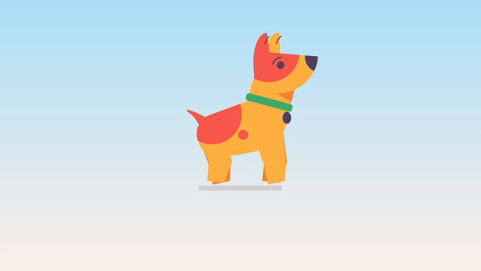

# Animated Walking Dog

This project is part of the #100DaysOfCode Challenge, specifically Day 28. It showcases an animated dog using CSS animations.

## Preview

<div style="display: flex; align-items: center; justify-content: center; width: 100%; border-radius: 0.6rem;">
    
</div>

This preview showcases the animated walking dog in action.

## Download Full Source Code

You can download the full source code for this project from the following link: [Download Source Code](https://t.me/CodeWithAarzoo)

## Description

The code provided creates an animated walking dog using CSS. The dog's various body parts, such as the head, ears, legs, and tail, are animated to create a lifelike movement. The animation is achieved through the use of CSS variables, keyframes, and various positioning and transformation techniques.

## Features

- Animated walking dog with a moving head, ears, legs, and tail
- Smooth and fluid animations using CSS keyframes
- Customizable colors and animation durations through CSS variables
- Responsive design that scales the dog to fit the viewport

## Usage

To use this project, simply include the CSS code in your HTML file and add the necessary HTML structure for the dog. You can customize the colors and animation durations by modifying the CSS variables at the top of the file.

```html
<!DOCTYPE html>
<html lang="en">
<head>
    <meta charset="UTF-8">
    <meta name="viewport" content="width=device-width, initial-scale=1.0">
    <title>Animated Walking Dog</title>
    <link rel="stylesheet" href="style.css">
</head>
<body>
    <div class="🐕">
        <!-- Dog structure goes here -->
    </div>
</body>
</html>
```

## Download

The full source code for this project can be downloaded from the following link:

[Download Source Code](https://t.me/CodeWithAarzoo)


## Acknowledgments

This project is part of the #100DaysOfCode Challenge, a popular coding challenge where developers commit to coding for at least an hour every day for 100 days. The challenge is a great way to improve coding skills and build a consistent coding habit.

## License

This project is licensed under the [MIT License](LICENSE), allowing you to modify and distribute the code as long as you include the original copyright and license notices.

## Credits

This code snippet has been crafted by [Aarzoo](https://twitter.com/withaarzoo).

## Support and Contact

For any inquiries or assistance regarding this project, feel free to reach out to the developer, Aarzoo, via [Bento](https://bento.me/withaarzoo).

Enjoy coding and have fun with your animated walking dog 🦁✨

---

Enjoy using the animated walking dog! If you have any questions or suggestions, please feel free to reach out.
