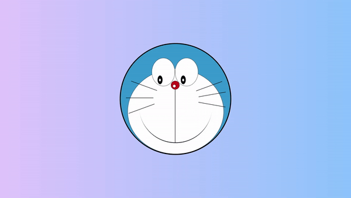

# Animated Doraemon

This is a simple HTML and CSS code snippet to create an animated representation of Doraemon, the famous cartoon character. The code utilizes basic HTML structure along with CSS styling to create the visual effect .

## Preview

    

This preview showcases the animated doraemon in action.

## Download Full Source Code

You can download the full source code for this project from the following link: [Download Source Code](https://t.me/CodeWithAarzoo)

## Prerequisites

To run this code, you need a web browser that supports HTML5 and CSS3.

## How to Use

1. Clone the repository or download the HTML and CSS files.
2. Open the `index.html` file in a web browser.
3. You should see an animated Doraemon character displayed on the screen.

## HTML Structure

The HTML file (`index.html`) contains the structure of the animated Doraemon. It includes:

- A `head` section with metadata and title.
- A `body` section containing the elements for Doraemon's head, eyes, nose, whiskers, and mouth.

## CSS Styling

The CSS file (`style.css`) provides the styling for the Doraemon character. It includes:

- Background gradient for the entire body.
- Styles for Doraemon's head, eyes, nose, and mouth.
- Animation effects for Doraemon's eyes.

## Animation

The animation effect for Doraemon's eyes is achieved using CSS keyframes. The `move` animation moves the black part of Doraemon's eyes to simulate blinking.

## Author

This code snippet is authored by [Aarzoo](https://twitter.com/withaarzoo).

## Credits

This code snippet has been crafted by [Aarzoo](https://twitter.com/withaarzoo).

## Support and Contact

For any inquiries or assistance regarding this project, feel free to reach out to the developer, Aarzoo, via [Bento](https://bento.me/withaarzoo).

Enjoy coding and have fun with your animated doraemon 😺✨

---

Enjoy using the animated doraemon! If you have any questions or suggestions, please feel free to reach out.
