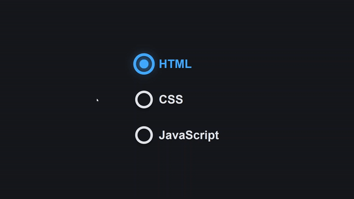

# Animated Radio Button

This project showcases an animated radio button selection interface implemented using HTML and CSS. It's part of the #100DaysOfCode Challenge.

## Preview

    

This preview showcases the animated tab bar in action.

## Features

- Selection of different options with animated transitions.
- Responsive design for compatibility across various devices.
- Dark mode support for improved visibility.

## Usage

To use this project, simply clone or download the source code. You can also access the code via the Telegram channel [CodeWithAarzoo](https://t.me/CodeWithAarzoo).

## Connect with Me

- Connect with me on [Bento](https://bento.me/withaarzoo) to stay updated on my projects and activities.

## Credits

This project was created as part of the #100DaysOfCode Challenge by [Aarzoo](https://bento.me/withaarzoo).

## License

This project is licensed under the MIT License - see the [LICENSE](LICENSE) file for details.
