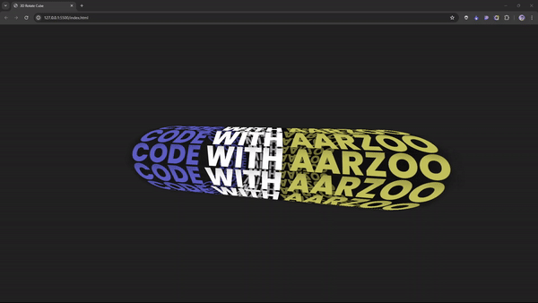

# 3D Rotate Tube with Animated Text

This project is part of Day 30 of the #100DaysOfCode Challenge.

This is a simple HTML and CSS code snippet that creates a 3D rotating tube with animated text on its faces. The tube is displayed in a webpage and the text on each face of the tubr changes dynamically, creating a visually engaging effect.

## Preview

    

This preview showcases the 3d rotate tube in action.

## Download Full Source Code

You can download the full source code for this project from the following link: [Download Source Code](https://t.me/CodeWithAarzoo)

## How it Works

The code uses HTML and CSS to create the 3D rotating cube effect:

### HTML Structure

The HTML structure is relatively simple:

- The `<!DOCTYPE html>` declaration specifies the document type and language.
- The `<head>` section includes metadata and references to external resources, such as fonts and a CSS file (`style.css`).
- The `<body>` section contains a `
` element with the class `container`. Inside this container, there is another `
` with the class `box`, which represents the 3D cube. Within the `box`, there are multiple `` elements, each containing text to be displayed on the cube's faces.

### CSS Styling

The CSS in the `style.css` file is responsible for the 3D rotating cube effect and the animated text:

- Various font families are imported from Google Fonts to be used in the text.
- Global reset rules ensure consistent styling across different browsers.
- The `body` element is styled to create a full-page display and center the cube.
- The `.container` class styles are used to center the `.box` element within the container.
- The `.box` class is where the 3D cube effect is applied. It uses the `transform-style` property to enable 3D transformations and applies an animation called `animate` to achieve the rotation effect.
- The `.box span` class styles each face of the cube. The `background` property adds a gradient background, and the `transform` property rotates each face along the X-axis.
- The `.box span i` styles the `<i>` elements (italic text) within the spans, allowing for additional text formatting.
- The `@keyframes animate` rule defines the animation sequence that rotates the cube along the X-axis and Y-axis, giving the illusion of a rotating cube.

## Usage

1. Copy the HTML code and save it in an HTML file.
2. Copy the CSS code and save it in a file named `style.css` in the same directory as the HTML file.
3. Open the HTML file in a web browser to see the 3D rotating cube with animated text.

Feel free to customize the text, fonts, colors, and animation properties to create your own unique 3D cube effect!

## License

This code is released under the [MIT License](LICENSE).

## Credits

This code snippet has been crafted by [Aarzoo](https://twitter.com/withaarzoo).

## Support and Contact

For any inquiries or assistance regarding this project, feel free to reach out to the developer, Aarzoo, via [Bento](https://bento.me/withaarzoo).

Enjoy coding and have fun with your 3d rotate tube 😺✨

---

Enjoy using the 3d rotate tube! If you have any questions or suggestions, please feel free to reach out.
