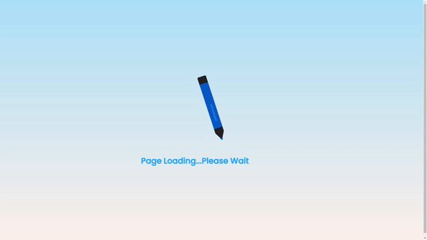

# Animated Pencil Loader

This project is part of Day 31 of the #100DaysOfCode Challenge.

This repository contains HTML and CSS code for an animated pencil loader, designed to be used as a loading animation for web pages. The loader consists of a pencil icon that animates in a loop, giving users a visual cue that the page is still loading.

## Preview

    

This preview showcases the animated pencil loader in action.

## Download Full Source Code

You can download the full source code for this project from the following link: [Download Source Code](https://t.me/CodeWithAarzoo)

## HTML Structure

The HTML file defines the structure of the loader. It includes a `<!DOCTYPE>` declaration and sets the document type as HTML. The content is enclosed within `<html>`, `<head>`, and `<body>` tags. Key elements include:

- **Character Encoding:** The document specifies UTF-8 character encoding for proper text rendering.
- **Viewport Configuration:** Meta tags are used to configure the viewport for responsive design.
- **External Stylesheet:** The HTML file links to an external CSS stylesheet named `style.css`.
- **Page Title:** The title of the webpage is set to "Animated Pencil Loader".
- **Loader Elements:** Various `
` elements are used to create the pencil loader, including subdivisions for the pencil's components and a horizontal line.

## CSS Styling

The CSS file (`style.css`) contains styling rules to customize the appearance and animation of the loader. Key styling features include:

- **Font:** The Google Fonts library is imported to use the "Poppins" font family.
- **Layout:** Flexbox layout is utilized to center the content both horizontally and vertically within the viewport.
- **Background:** Gradient background colors are applied to the body element.
- **Pencil Animation:** Keyframes are defined to animate the rotation and movement of the pencil icon.
- **Pencil Components:** Styling rules are provided for each component of the pencil, including the ball point, cap, middle section, and eraser.
- **Line Animation:** Another set of keyframes is defined to animate the horizontal line below the pencil.
- **Typography:** Font size and positioning are adjusted for the loading message.

## Usage

To use this animated pencil loader on your webpage, simply include the HTML and CSS code provided in this repository. You can customize the loader's appearance and animation by modifying the CSS styles according to your preferences.

## License

This code is provided under the MIT License. Feel free to use and modify it for your own projects. See the [LICENSE](LICENSE) file for more details.

## Credits

This code snippet has been crafted by [Aarzoo](https://twitter.com/withaarzoo).

## Support and Contact

For any inquiries or assistance regarding this project, feel free to reach out to the developer, Aarzoo, via [Bento](https://bento.me/withaarzoo).

Enjoy coding and have fun with your animated pencil loader ✏️✨

---

Enjoy using the animated pencil loader! If you have any questions or suggestions, please feel free to reach out.
