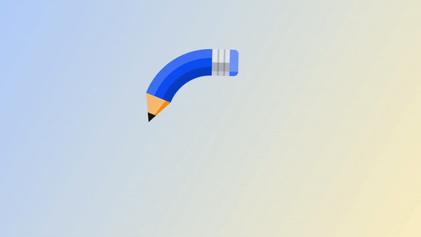

# Pencil Loader

This project is part of Day 32 of the #100DaysOfCode Challenge.

This is an HTML and CSS code for a pencil loader animation. The loader consists of a pencil with three different-colored circular bodies, an eraser, and a point.

## Preview

<div style="display: flex; align-items: center; justify-content: center; width: 100%; border-radius: 0.6rem;">
    
</div>

This preview showcases the animated pencil loader in action.

## Download Full Source Code

You can download the full source code for this project from the following link: [Download Source Code](https://t.me/CodeWithAarzoo)

## Prerequisites

To run this code, you will need a web browser that supports SVGs.

## Installing

You can download the source code directly or clone the repository using the following command:

``` bash
git clone https://github.com/Aarzoo75/Pencil-Loader.git
```

## Usage

To use the pencil loader, simply open the index.html file in your web browser. You can also copy and paste the code into your own HTML and CSS files and modify it as necessary.

## Customization

You can customize the size of the loader by modifying the width and height properties in the .pencil CSS class. You can also change the colors of the loader by modifying the stroke and fill properties in the .pencil__body1, .pencil__body2, .pencil__body3, .pencil__eraser-skew, .pencil__point, and .pencil__stroke CSS classes.

## License

This code is provided under the MIT License. Feel free to use and modify it for your own projects. See the [LICENSE](LICENSE) file for more details.

## Credits

This code snippet has been crafted by [Aarzoo](https://twitter.com/withaarzoo).

## Support and Contact

For any inquiries or assistance regarding this project, feel free to reach out to the developer, Aarzoo, via [Bento](https://bento.me/withaarzoo).

Enjoy coding and have fun with your animated pencil loader ✏️✨

---

Enjoy using the animated pencil loader! If you have any questions or suggestions, please feel free to reach out.
