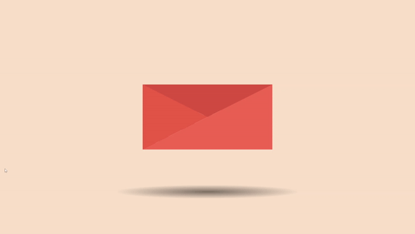

# Animated Mail Button

This project is part of day 34 of the #100DaysOfCode Challenge.

It features an animated mail button created using HTML and CSS. When you hover over the mail button, the top fold of the envelope rotates, and the letter inside expands to reveal its content. A shadow effect also adjusts to enhance the animation.

## Preview

    

This preview showcases the animated mail button in action.

## Download Full Source Code

You can download the full source code for this project from the following link: [Download Source Code](https://t.me/CodeWithAarzoo)

## Project Overview

The project consists of an HTML structure and a CSS stylesheet. The HTML sets up the structure of the animated mail button, while the CSS provides the styling and animations.

### HTML Structure

The HTML file includes:

- A container for the letter image.
- Various div elements representing different parts of the envelope and the letter.

### CSS Styling

The CSS file includes:

- General styles for the body background.
- Detailed styles and animations for the envelope and letter parts.

### Key Features

- **Responsive Centering**: The mail button is centered in the viewport using CSS transformations.
- **Smooth Animations**: Transitions and transformations provide a smooth animation effect when the envelope is hovered over.
- **Realistic Envelope**: The envelope consists of multiple parts (back fold, top fold, left fold) to create a realistic look.

## How to Use

1. **Download the Source Code**: You can download the full source code from [here](https://t.me/CodeWithAarzoo).
2. **Include the HTML and CSS Files**: Make sure to include the `index.html` and `style.css` files in your project.
3. **Open the HTML File**: Open the `index.html` file in your browser to see the animated mail button in action.

## License

This project is licensed under the MIT License. See the LICENSE file for details.

I hope this README provides a clear and informative overview of the animated cube loader code!

## Credits

This code snippet has been crafted by [Aarzoo](https://twitter.com/withaarzoo).

## Support and Contact

For any inquiries or assistance regarding this project, feel free to reach out to the developer, Aarzoo, via [Bento](https://bento.me/withaarzoo).

Enjoy coding and have fun with your animated mail button ✉️✨

---

Enjoy using the animated mail button ! If you have any questions or suggestions, please feel free to reach out.
