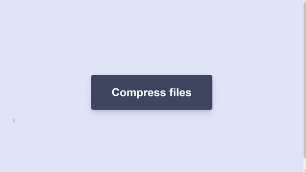

# Animated Compress File Button

## Overview

This project is part of day 36 of the #100DaysOfCode Challenge.

This project demonstrates an animated button compression effect using HTML, CSS, and JavaScript. The primary objective is to create an engaging user interface element that visually indicates a button press or action.

## Preview

    

This preview showcases the animated compress file button in action.

## Download Full Source Code

You can download the full source code for this project from the following link: [Download Source Code](https://t.me/CodeWithAarzoo)

## Features

- **Button Animation:** When a button is clicked, it undergoes a compression animation, visually indicating the action.
- **Timeout Removal:** The compression effect is automatically reversed after a set duration, providing a smooth user experience.
- **Modern JavaScript:** Utilizes modern JavaScript syntax and practices for enhanced readability and maintainability.
- **Advanced CSS:** Employs advanced CSS techniques, including custom properties and keyframe animations, to achieve the desired visual effects.

## Technologies Used

- **HTML:** Provides the structure and markup for the button elements.
- **CSS:** Styles the button and defines the animations for the compression effect.
- **JavaScript:** Implements the interactive behavior and timing logic for the compression animation.
  
## Usage

1. Clone the repository to your local machine.
2. Open the `index.html` file in a web browser.
3. Click on the button to trigger the compression animation.
4. Observe the button's visual transformation and automatic reversal after a few seconds.

## Installation

No installation steps are required for this project. Simply open the `index.html` file in any modern web browser to view the animation in action.

## Contributors

- [Aarzoo](https://github.com/withaarzoo): Project Lead & Developer

## License

This project is licensed under the [MIT License](LICENSE). Feel free to use and modify the code for your own purposes.

## Feedback and Contributions

Feedback, bug reports, and contributions are welcome! Please submit them via [GitHub Issues](https://github.com/withaarzoo/100-Days-of-Code/tree/main/%5B%20Day%2036%20%5D%20-%20Animated%20Compress%20File%20Button/issues) or create a pull request with your proposed changes.

## Credits

This code snippet has been crafted by [Aarzoo](https://twitter.com/withaarzoo).

## Support and Contact

For any inquiries or assistance regarding this project, feel free to reach out to the developer, Aarzoo, via [Bento](https://bento.me/withaarzoo).

Enjoy coding and have fun with your animated compress file button 📁✨
