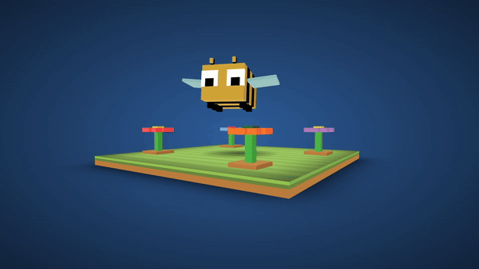

# Animated 3D Bee

This project is part of day 38 of the #100DaysOfCode Challenge.

The **Animated 3D Bee** is a fun and eye-catching project created using HTML and CSS. This project brings a delightful 3D bee to life on your webpage, sure to capture the attention of your website visitors. Whether you want to add a playful touch to your website or simply learn more about CSS animations, this project is perfect for you.

## Preview

<div style="display: flex; align-items: center; justify-content: center; width: 100%; border-radius: 0.6rem;">
    
</div>

This preview showcases the animated 3d bee in action.

## Download Full Source Code

You can download the full source code for this project from the following link: [Download Source Code](https://t.me/CodeWithAarzoo)

## Features

- Realistic 3D bee animation.
- Created entirely using HTML and CSS.
- Lightweight and easy to integrate into any web project.

## Usage

1. Clone the repository:

   ```bash
   git clone https://github.com/Aarzoo75/Animated-3D-Bee.git
   ```

2. Navigate to the project folder:

   ```bash
   cd Animated-3D-Bee
   ```

3. Open the `index.html` file in your favorite web browser or integrate it into your own HTML project.

4. Customize the bee's appearance or animation by modifying the CSS in the `styles.css` file.

## Customization

You can easily customize the appearance and behavior of the 3D bee by editing the CSS in the `styles.css` file. Feel free to experiment with different colors, sizes, and animation styles to make it fit your project's theme.

Here's an example of how you can customize the bee's appearance:

```css
/* Change the bee's color */
.bee {
  background-color: #ff9900; /* Change to your desired color */
}

/* Adjust the bee's size */
.bee {
  width: 100px; /* Change to your desired size */
  height: 100px; /* Change to your desired size */
}
```

## Credits

This project was created by [Aarzoo](https://x.com/withaarzoo).

## License

This project is licensed under the [MIT License](LICENSE). Feel free to use and modify the code for your own purposes.

## Feedback and Contributions

Feedback, bug reports, and contributions are welcome! Please submit them via [GitHub Issues](https://github.com/withaarzoo/100-Days-of-Code/tree/main/%5B%20Day%2036%20%5D%20-%20Animated%20Compress%20File%20Button/issues) or create a pull request with your proposed changes.

## Support and Contact

For any inquiries or assistance regarding this project, feel free to reach out to the developer, Aarzoo, via [Bento](https://bento.me/withaarzoo).

Enjoy coding and have fun with your animated 3d bee 🐝✨
