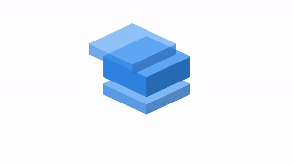

# Animated 3D Loader

This project is part of day 42 of the #100DaysOfCode Challenge.

This project provides an animated 3D loader implemented in HTML and CSS. The loader consists of four boxes that move in a coordinated manner, creating a visually appealing loading animation. Each box has three sides with different colors, giving the illusion of a 3D effect as they rotate and animate.

## Preview

<div style="display: flex; align-items: center; justify-content: center; width: 100%; border-radius: 0.6rem;">
    
</div>

This preview showcases the animated 3d loader in action.

## Download Full Source Code

You can download the full source code for this project from the following link: [Download Source Code](https://t.me/CodeWithAarzoo)

## Features

- **Visually Appealing**: The loader offers a visually engaging animation that captures users' attention while waiting for content to load.
- **Customizable**: The colors and timing of the animation can be easily customized by modifying the CSS code.
- **Responsive**: The loader is designed to be responsive and works well on various screen sizes and devices.

## Usage

To use the animated 3D loader in your project, follow these steps:

1. Copy the HTML code from `index.html` into your HTML file where you want the loader to appear.
2. Copy the CSS code from `styles.css` into your CSS file or add it directly to your HTML file within a `<style>` tag.
3. Adjust the colors and timing of the animation as needed by modifying the CSS code.

```html
<!-- HTML code -->
<div class="loader">
    <!-- Loader animation will be rendered here -->
</div>
```

```css
/* CSS code */
.loader {
    /* Customize the loader size and scale */
    scale: 3;
    height: 50px;
    width: 40px;
    /* Add any additional styles or animations here */
}
```

## Compatibility

The code is designed to work on modern web browsers that support HTML5 and CSS3 features. Compatibility may vary on older browsers or outdated versions.

## Contributing

Contributions are welcome! Please fork the repository and submit a pull request with your changes. Ensure your code adheres to the project's coding standards and include relevant tests.

## Credits

This project was created by [Aarzoo](https://x.com/withaarzoo).

## License

This project is licensed under the [MIT License](LICENSE). Feel free to use and modify the code for your own purposes.

## Support and Contact

For any inquiries or assistance regarding this project, feel free to reach out to the developer, Aarzoo, via [Bento](https://bento.me/withaarzoo).

Enjoy coding and have fun with your animated 3d loader ⏹️✨
