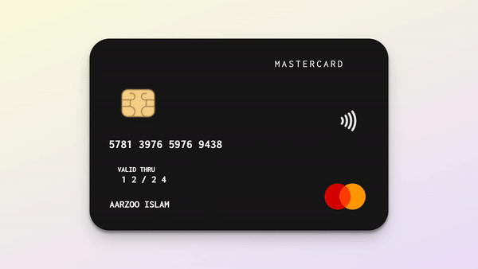

# 3D Credit Card Flip Animation

This project is part of day 43 of the #100DaysOfCode Challenge.

This repository contains HTML and CSS code for creating a 3D credit card flip animation. It simulates the front and back sides of a credit card and includes animations for flipping the card when hovered over.

## Preview

    

This preview showcases the 3d credit card flip animation in action.

## Download Full Source Code

You can download the full source code for this project from the following link: [Download Source Code](https://t.me/CodeWithAarzoo)

## Features

- **3D Flip Animation**: The credit card flips horizontally when hovered over, revealing the back side.
- **Front and Back Side Styling**: Both sides of the credit card are styled with relevant information such as card number, cardholder name, chip, and contactless payment symbol.
- **Realistic Design**: The design mimics the appearance of a real credit card, including a magnetic strip, signature strip, and security code area.
- **Responsive**: The layout is responsive and adjusts well to different screen sizes.

## Technologies Used

- HTML
- CSS

## Usage

To use this code, simply clone the repository and open the `index.html` file in your web browser. You can also integrate the HTML and CSS into your existing project to add a similar credit card animation.

## Compatibility

The code is designed to work on modern web browsers that support HTML5 and CSS3 features. Compatibility may vary on older browsers or outdated versions.

## Contributing

Contributions are welcome! Please fork the repository and submit a pull request with your changes. Ensure your code adheres to the project's coding standards and include relevant tests.

## Credits

This project was created by [Aarzoo](https://x.com/withaarzoo).

## License

This project is licensed under the [MIT License](LICENSE). Feel free to use and modify the code for your own purposes.

## Support and Contact

For any inquiries or assistance regarding this project, feel free to reach out to the developer, Aarzoo, via [Bento](https://bento.me/withaarzoo).

Enjoy coding and have fun with your 3d credit card flip animation 💳✨
