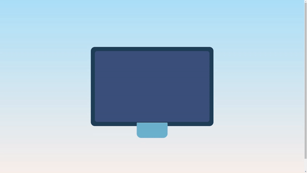

# Animated Multi Device Loader

This project is part of day 44 of the #100DaysOfCode Challenge.

This project provides a set of animated loader elements styled with CSS. These loaders are designed to resemble multiple electronic devices and can be easily integrated into web pages to indicate loading or processing.

## Preview

<div style="display: flex; align-items: center; justify-content: center; width: 100%; border-radius: 0.6rem;">
    
</div>

This preview showcases the animated device loader in action.

## Download Full Source Code

You can download the full source code for this project from the following link: [Download Source Code](https://t.me/CodeWithAarzoo)

## Features

- Three loader elements styled to resemble different electronic devices.
- Smooth and visually appealing animations created with CSS keyframes.
- Responsive design that adapts to different screen sizes and orientations.
- Easy integration into HTML pages using simple markup.

## Usage

To use the Animated Multi Device Loader in your project:

1. Download or clone this repository.
2. Copy the `style.css` file into your project's CSS directory.
3. Copy the HTML code provided in the `index.html` file and paste it into your HTML file where you want the loader to appear.
4. Ensure that the paths to the `style.css` file are correctly specified in your HTML file.

```html
<link rel="stylesheet" href="path/to/style.css">
```

5. Customize the loader elements by modifying the CSS classes or animations as needed.

## Compatibility

The code is designed to work on modern web browsers that support HTML5 and CSS3 features. Compatibility may vary on older browsers or outdated versions.

## Contributing

Contributions are welcome! Please fork the repository and submit a pull request with your changes. Ensure your code adheres to the project's coding standards and include relevant tests.

## Credits

This project was created by [Aarzoo](https://x.com/withaarzoo).

## License

This project is licensed under the [MIT License](LICENSE). Feel free to use and modify the code for your own purposes.

## Support and Contact

For any inquiries or assistance regarding this project, feel free to reach out to the developer, Aarzoo, via [Bento](https://bento.me/withaarzoo).

Enjoy coding and have fun with your animated device loader 💻📱✨
