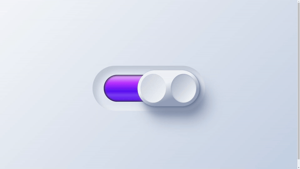

# Neumorphism Toggle Button

This project is part of day 46 of the #100DaysOfCode Challenge.

This project showcases a stylish toggle button designed using the neumorphism design trend. Neumorphism, a portmanteau of "new" and "skeuomorphism," is characterized by subtle shadows and highlights that create a soft, extruded plastic look. The toggle button is created using HTML and CSS, emphasizing modern design aesthetics and smooth transitions.

## Table of Contents

- [Preview](#preview)
- [Download Full Source Code](#download-full-source-code)
- [Features](#features)
- [Installation](#installation)
- [Usage](#usage)
- [Project Structure](#project-structure)
- [Customization](#customization)
- [Contributing](#contributing)
- [License](#license)

## Preview

<div style="display: flex; align-items: center; justify-content: center; width: 100%; border-radius: 0.6rem;">
    
</div>

This preview showcases the neumorphism toggle switch in action.

## Download Full Source Code

You can download the full source code for this project from the following link: [Download Source Code](https://t.me/CodeWithAarzoo)

## Features

- **Neumorphism Design**: Soft, extruded look with subtle shadows and highlights.
- **Responsive**: Adaptable to different screen sizes.
- **Smooth Transitions**: CSS transitions for a polished, user-friendly experience.
- **Customizable**: Easily tweak colors, sizes, and other properties via CSS variables.

## Installation

To get started with the neumorphism toggle button, you can clone the repository or download the files directly.

### Clone the Repository

```bash
git clone https://github.com/withaarzoo/100-Days-of-Code/tree/main/%5B%20Day%2046%20%5D%20-%20Neumorphism%20Toggle%20Button.git
```

### Download the Files

You can download the project as a ZIP file and extract it.

## Usage

To use the toggle button in your project, follow these steps:

1. **Include the CSS File**: Link the `style.css` file in your HTML document.

    ```html
    <link rel="stylesheet" href="style.css">
    ```

2. **HTML Structure**: Use the provided HTML structure to include the toggle button in your webpage.

    ```html
    <!DOCTYPE html>
    <html lang="en">
    <head>
        <meta charset="UTF-8">
        <meta name="viewport" content="width=device-width, initial-scale=1.0">
        <link rel="stylesheet" href="style.css">
        <title>Neumorphism Toggle Button</title>
    </head>
    <body>
        <div class="container">
            <label class="switch">
                <input class="togglesw" type="checkbox" checked>
                <div class="indicator left"></div>
                <div class="indicator right"></div>
                <div class="button"></div>
            </label>
        </div>
    </body>
    </html>
    ```

3. **CSS Styling**: The CSS provided in `style.css` contains all the necessary styles for the toggle button.

## Project Structure

The project consists of the following files:

- `index.html`: The main HTML file containing the structure of the toggle button.
- `style.css`: The CSS file with all styles for the neumorphism toggle button.

## Customization

You can customize the appearance of the toggle button by modifying the CSS variables in the `style.css` file. Here are some of the key variables you can adjust:

- `--hue`: Base hue for the colors.
- `--width`: Width of the toggle switch.
- `--accent-hue`: Accent hue for the left indicator.
- `--duration`: Duration for transitions.
- `--easing`: Easing function for transitions.

Example:

```css
.container {
    --hue: 220deg;
    --width: 15rem;
    --accent-hue: 260deg;
    --duration: 0.6s;
    --easing: cubic-bezier(1, 0, 1, 1);
}
```

## Contributing

Contributions are welcome! If you have suggestions or improvements, feel free to create an issue or submit a pull request.

1. Fork the repository.
2. Create your feature branch (`git checkout -b feature/new-feature`).
3. Commit your changes (`git commit -am 'Add new feature'`).
4. Push to the branch (`git push origin feature/new-feature`).
5. Create a new pull request.

## Compatibility

The code is designed to work on modern web browsers that support HTML5 and CSS3 features. Compatibility may vary on older browsers or outdated versions.

## Contributing

Contributions are welcome! Please fork the repository and submit a pull request with your changes. Ensure your code adheres to the project's coding standards and include relevant tests.

## Credits

This project was created by [Aarzoo](https://x.com/withaarzoo).

## License

This project is licensed under the [MIT License](LICENSE). Feel free to use and modify the code for your own purposes.

## Support and Contact

For any inquiries or assistance regarding this project, feel free to reach out to the developer, Aarzoo, via [Bento](https://bento.me/withaarzoo).

Enjoy coding and have fun with your neumorphism toggle button 🕹️✨
