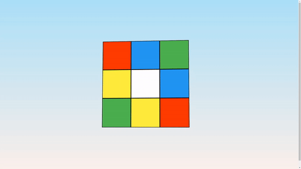

# Animated Rubik's Cube Loader

This project is part of day 47 of the #100DaysOfCode Challenge.

This project showcases an animated Rubik's Cube loader using HTML and CSS. The loader is a visually appealing animation that can be used as a loading indicator for web applications. The cube rotates smoothly, giving a 3D effect that enhances the user experience during loading times.

## Preview

<div style="display: flex; align-items: center; justify-content: center; width: 100%; border-radius: 0.6rem;">
    
</div>

This preview showcases the animated rubik cube loader in action.

## Download Full Source Code

You can download the full source code for this project from the following link: [Download Source Code](https://t.me/CodeWithAarzoo)

## Features

- **3D Animated Loader**: A rotating Rubik's Cube that gives a 3D illusion.
- **Responsive Design**: The loader is centered and adjusts to different screen sizes.
- **Easy Integration**: Simple to integrate into any web project.

## Getting Started

To get started with the animated Rubik's Cube loader, follow these steps:

### Prerequisites

- Basic understanding of HTML and CSS.
- A text editor or an IDE (e.g., Visual Studio Code, Sublime Text).

### Installation

1. **Clone the repository:**

    ```bash
    git clone https://github.com/yourusername/rubiks-cube-loader.git
    ```

2. **Navigate to the project directory:**

    ```bash
    cd rubiks-cube-loader
    ```

3. **Open `index.html` in your browser:**

    You can open the `index.html` file directly in your browser to see the loader in action.

## Project Structure

The project consists of the following files:

- `index.html`: The main HTML file that contains the structure of the loader.
- `style.css`: The CSS file that styles and animates the loader.

## Usage

To use this loader in your project:

1. Copy the `index.html` and `style.css` files to your project directory.
2. Include the CSS file in your HTML.
3. Add the loader container (`<div class="my-loader">...</div>`) where you want the loader to appear.

## Customization

You can customize the loader by modifying the CSS:

- **Size**: Change the `width` and `height` of the `.my-loader` class.
- **Colors**: Modify the `background` styles of the `.cube` elements.
- **Animation Duration**: Adjust the `animation` property in the `.rubiks-cube` class to change the speed of the rotation.

## Compatibility

The code is designed to work on modern web browsers that support HTML5 and CSS3 features. Compatibility may vary on older browsers or outdated versions.

## Contributing

Contributions are welcome! Please fork the repository and submit a pull request with your changes. Ensure your code adheres to the project's coding standards and include relevant tests.

## Credits

This project was created by [Aarzoo](https://x.com/withaarzoo).

## License

This project is licensed under the [MIT License](LICENSE). Feel free to use and modify the code for your own purposes.

## Support and Contact

For any inquiries or assistance regarding this project, feel free to reach out to the developer, Aarzoo, via [Bento](https://bento.me/withaarzoo).

Enjoy coding and have fun with your animated rubik cube loader 🟨✨
