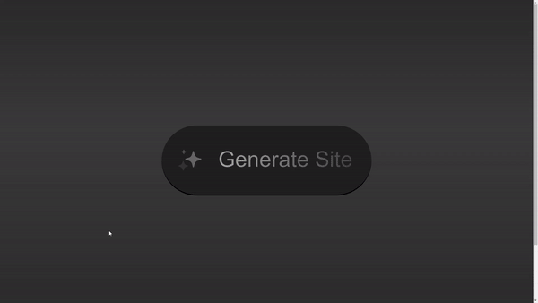

# Sparkle Button CSS Project

This project is part of day 48 of the #100DaysOfCode Challenge.

This project showcases a dynamic, interactive button with a sparkle animation effect using pure CSS. The button is designed to provide an engaging user experience with responsive animations that react to user interactions such as hovering and clicking. This project is a great example of using advanced CSS techniques like custom properties, animations, and pseudo-elements to create visually appealing UI components without relying on JavaScript.

## Preview

<div style="display: flex; align-items: center; justify-content: center; width: 100%; border-radius: 0.6rem;">
    
</div>

This preview showcases the animated modern button in action.

## Download Full Source Code

You can download the full source code for this project from the following link: [Download Source Code](https://t.me/CodeWithAarzoo)

## Features

- **Centered Button**: The button is centrally aligned both horizontally and vertically within the viewport.
- **Gradient Background**: The background consists of blended gradients, giving it a sophisticated, layered look.
- **Dynamic Animations**: Includes hover and active state animations that create a sparkle effect.
- **Custom Properties**: Utilizes CSS variables for easy customization and maintenance.
- **Responsive Design**: The button and its animations are designed to be responsive and work seamlessly across different screen sizes.

## Installation

To use this project, simply clone the repository and open the `index.html` file in your browser.

```sh
git clone https://github.com/withaarzoo/100-Days-of-Code/tree/main/%5B%20Day%2048%20%5D%20-%20Animated%20Modern%20Button.git
cd sparkle-button-css
open index.html
```

### Prerequisites

- Basic understanding of HTML and CSS.
- A text editor or an IDE (e.g., Visual Studio Code, Sublime Text).

## Project Structure

The project consists of the following files:

- `index.html`: The main HTML file that contains the structure of the loader.
- `style.css`: The CSS file that styles and animates the loader.

## Compatibility

The code is designed to work on modern web browsers that support HTML5 and CSS3 features. Compatibility may vary on older browsers or outdated versions.

## Contributing

Contributions are welcome! Please fork the repository and submit a pull request with your changes. Ensure your code adheres to the project's coding standards and include relevant tests.

## Credits

This project was created by [Aarzoo](https://x.com/withaarzoo).

## License

This project is licensed under the [MIT License](LICENSE). Feel free to use and modify the code for your own purposes.

## Support and Contact

For any inquiries or assistance regarding this project, feel free to reach out to the developer, Aarzoo, via [Bento](https://bento.me/withaarzoo).

Enjoy coding and have fun with your animated modern button ✨
