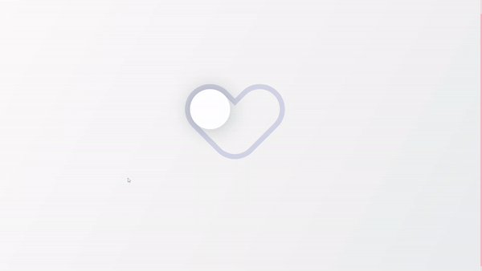

# Animated Heart Shape Toggle Switch

This project is part of day 49 of the #100DaysOfCode Challenge.

This project showcases an animated heart-shaped toggle switch implemented using HTML and CSS. The toggle switch is designed to visually represent a heart, which changes its appearance when toggled. The animation is smooth and visually appealing, providing a delightful user experience.

## Preview

<div style="display: flex; align-items: center; justify-content: center; width: 100%; border-radius: 0.6rem;">
    
</div>

This preview showcases the animated heart shape toggle switch in action.

## Download Full Source Code

You can download the full source code for this project from the following link: [Download Source Code](https://t.me/CodeWithAarzoo)

## Features

- **Heart Shape Design:** The toggle switch is creatively designed to resemble a heart shape.
- **Smooth Animation:** The toggle switch animates smoothly between its states.
- **Custom Scrollbar Styling:** The scrollbar is customized for a unique visual appearance.
- **Responsive Design:** The layout is centered and responsive, adapting to various screen sizes.

## Getting Started

To get started with this project, clone the repository and open the `index.html` file in your preferred web browser.

```bash
git clone https://github.com/withaarzoo/100-Days-of-Code/tree/main/%5B%20Day%2049%20%5D%20-%20Animated%20Heart%20Shape%20Toggle%20Switch.git
cd animated-heart-toggle-switch
open index.html
```

## Usage

Once you have the project open in your browser, you will see a heart-shaped toggle switch in the center of the screen. Click on the heart to toggle its state. The heart will animate smoothly between its on and off states.

## Customization

You can customize the colors, sizes, and animations to fit your project's needs by modifying the CSS file. For example, you can change the heart color or the animation duration.

## Compatibility

The code is designed to work on modern web browsers that support HTML5 and CSS3 features. Compatibility may vary on older browsers or outdated versions.

## Contributing

Contributions are welcome! Please fork the repository and submit a pull request with your changes. Ensure your code adheres to the project's coding standards and include relevant tests.

## Credits

This project was created by [Aarzoo](https://x.com/withaarzoo).

## License

This project is licensed under the [MIT License](LICENSE). Feel free to use and modify the code for your own purposes.

## Support and Contact

For any inquiries or assistance regarding this project, feel free to reach out to the developer, Aarzoo, via [Bento](https://bento.me/withaarzoo).

Enjoy coding and have fun with your animated heart shape toggle switch ❤️✨
