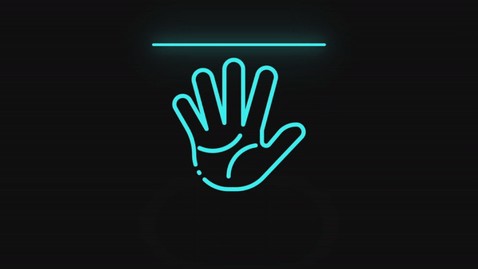

# Hand Scanning Animation Project

This project is part of the Day 5 challenge of the #100DaysOfCode initiative by **[Aarzoo](https://bento.me/withaarzoo)**. It demonstrates an animated hand scanning effect using HTML and CSS. You can find the source code for this project on **[CodeWithAarzoo Telegram Channel](https://t.me/CodeWithAarzoo)**.

## Overview

The hand scanning animation project is a simple yet visually appealing demonstration of CSS animations. It creates an illusion of a hand scanning process with lines moving up and down, representing the progress of the scan.

## Preview

<div style="display: flex; align-items: center; justify-content: center; width: 100%; border-radius: 0.6rem;">
    
</div>

This preview showcases the animated tab bar in action.

## Features

- Realistic hand scanning animation effect.
- Utilizes CSS animations for smooth and engaging visuals.
- Minimalistic HTML structure for easy understanding.

## Usage

To use this project, simply clone or download the source code from the **[CodeWithAarzoo Telegram Channel](https://t.me/CodeWithAarzoo)**. You can then open the `index.html` file in your web browser to view the animation.

```bash
git clone https://t.me/CodeWithAarzoo.git
```

## Project Structure

- **index.html:** Contains the HTML structure of the webpage.
- **style.css:** Contains the CSS styles and animations for the hand scanning effect.
- **hand_01.png:** Image asset used for the hand scanning animation.
- **hand_02.png:** Image asset used for the hand scanning animation.
- **lines.png:** Image asset used for the scanning lines animation.
- **points.png:** Image asset used for the scanning points animation.

## Contributing

Contributions to this project are welcome! If you have any suggestions, improvements, or feature requests, feel free to create an issue or submit a pull request.

## Contact

For any inquiries or feedback regarding this project, you can contact Aarzoo through **[bento.me](https://bento.me/withaarzoo)**.

Let's continue learning and coding together! 🚀
