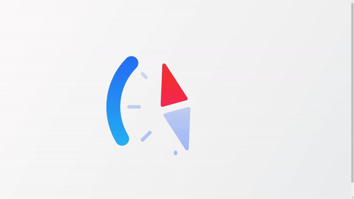

# Animated Compass Loader

This project is part of day 52 of the #100DaysOfCode Challenge.

This project features an animated compass loader built using HTML and CSS. The loader is designed to be visually appealing and is implemented with scalable vector graphics (SVG) to ensure sharp rendering at any size. The compass loader can be used in web projects as a preloader or a loading animation.

## Preview

<div style="display: flex; align-items: center; justify-content: center; width: 100%; border-radius: 0.6rem;">
    
</div>

This preview showcases the animated compass loader in action.

## Download Full Source Code

You can download the full source code for this project from the following link: [Download Source Code](https://t.me/CodeWithAarzoo)

## Features

- **Responsive Design:** The loader scales well on different screen sizes.
- **Pure CSS Animations:** Smooth and performant animations using CSS keyframes.
- **SVG Graphics:** Crisp and scalable graphics for any resolution.
- **Customizable:** Easily change colors, sizes, and animation durations.

## Installation

To use the animated compass loader in your project, follow these steps:

1. **Clone the Repository:**

    ```bash
    git clone https://github.com/yourusername/animated-compass-loader.git
    ```

2. **Navigate to the Project Directory:**

    ```bash
    cd animated-compass-loader
    ```

## Contributing

Contributions are welcome! If you have any ideas or improvements, feel free to open an issue or submit a pull request.

1. Fork the repository.
2. Create your feature branch (`git checkout -b feature/AmazingFeature`).
3. Commit your changes (`git commit -m 'Add some AmazingFeature'`).
4. Push to the branch (`git push origin feature/AmazingFeature`).
5. Open a pull request.

## Compatibility

The code is designed to work on modern web browsers that support HTML5 and CSS3 features. Compatibility may vary on older browsers or outdated versions.

## Credits

This project was created by [Aarzoo](https://x.com/withaarzoo).

## License

This project is licensed under the [MIT License](LICENSE). Feel free to use and modify the code for your own purposes.

## Support and Contact

For any inquiries or assistance regarding this project, feel free to reach out to the developer, Aarzoo, via [Bento](https://bento.me/withaarzoo).

Enjoy coding and have fun with your animated compass loader 🧭✨
