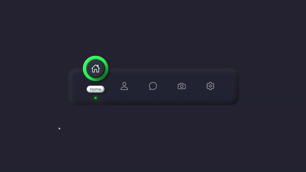

# Animated Navigation Tab Menu

This project is part of Day 6 of the #100DaysOfCode Challenge, designed to improve your coding skills by coding for at least an hour every day for 100 days straight.

## Description

This project features an animated navigation tab menu built with HTML, CSS, and JavaScript. It provides an interactive and visually appealing way to navigate through different sections of a web application or website.

## Preview

    

This preview showcases the animated tab bar in action.

## Features

- Interactive navigation menu with animated transitions.
- Each tab has an icon and text for easy identification.
- Active tab is highlighted with a distinctive style.
- Smooth animations enhance user experience.

## Installation

You can download the full source code of this project from [here](https://t.me/CodeWithAarzoo).

## Usage

1. Clone the repository or download the source code.
2. Open the HTML file in your web browser.
3. Click on the navigation tabs to switch between sections.

## Contributing

Contributions are welcome! If you find any bugs or want to suggest improvements, feel free to open an issue or create a pull request.

## Contact

For any inquiries or further information, you can contact the project creator, Aarzoo, via [Bento](https://bento.me/withaarzoo).

## License

This project is licensed under the MIT License - see the [LICENSE](LICENSE) file for details.
